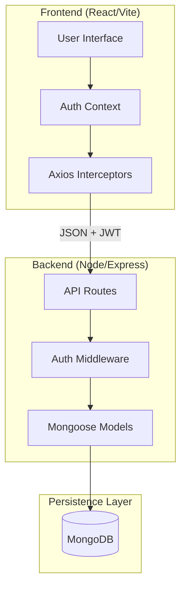

# FinanceTracker - Industrial-Grade Personal Finance Management

FinanceTracker is a high-performance, secure, and intuitive web application designed for comprehensive personal financial management. Built with the MERN stack (MongoDB, Express, React, Node.js), it provides real-time financial insights, budget tracking, and transaction management with a premium dark-themed interface.

---

## 🚀 Key Features

### 🔐 Advanced Security & Auth
- **JWT-based Authentication**: Secure stateless authentication using JSON Web Tokens.
- **Client-Side Persistence**: Token management via `localStorage` for seamless sessions.
- **Protected Routing**: Role-based access control for secure dashboard interactions.
- **Secure Hashing**: Multi-layer password hashing using `bcryptjs`.

### 💰 Transaction Management
- **Universal Tracking**: Record Income and Expenses with precision.
- **Recurring Logic**: Support for Monthly and Weekly automated transaction tagging.
- **Filtering & Search**: Industrial search engine for transaction lookup by description, category, and date range.

### 📊 Financial Insights
- **Savings Analytics**: Real-time calculation of "Savings Rate" to measure financial health.
- **Dynamic Dashboard**: Balanced overview of Total Income, Expenses, and current Net Worth.
- **Budget Guardrails**: Visual progress bars per category with over-budget alerts.

---

## 🛠️ Tech Stack

| Component | Technology | Role |
| :--- | :--- | :--- |
| **Frontend** | React 19, Vite | Fast UI/UX rendering & bundling |
| **Routing** | React Router 7 | Client-side navigation |
| **State** | React Context API | Global state for Auth |
| **Styling** | Vanilla CSS3 | Custom high-performance dark theme |
| **Icons** | Lucide React | Premium vector iconography |
| **Backend** | Node.js, Express 5 | High-concurrency API layer |
| **Database** | MongoDB, Mongoose | NoSQL persistence with schema validation |
| **Security** | JWT, bcryptjs | Industry-standard encryption |

---

## 🏗️ System Architecture



---

## 📂 Project Structure

```text
AssignmentHyscalar/
├── client/                # React Frontend
│   ├── src/
│   │   ├── api/          # Axios instance & interceptors
│   │   ├── components/   # Reusable UI components
│   │   ├── context/      # AuthContext provider
│   │   ├── pages/        # Main route views
│   │   └── styles/       # Modular CSS system
│   └── package.json
├── server/                # Express Backend
│   ├── middleware/       # JWT verification
│   ├── models/           # Mongoose schemas (User, Budget, Transaction)
│   ├── routes/           # API Endpoints
│   ├── index.js          # Server entry point
│   └── package.json
└── README.md              # Documentation
```

---

## 🚦 API Reference

### Authentication
| Method | Endpoint | Description |
| :--- | :--- | :--- |
| `POST` | `/api/auth/register` | Create new user account |
| `POST` | `/api/auth/login` | Authenticate & receive JWT |
| `GET` | `/api/auth/check` | Verify token & get user profile |

### Transactions
| Method | Endpoint | Description | Query Params |
| :--- | :--- | :--- | :--- |
| `GET` | `/api/transactions` | Fetch all logs | `type`, `category`, `startDate`, `endDate`, `search` |
| `POST` | `/api/transactions` | Add new entry | N/A |
| `DELETE` | `/api/transactions/:id` | Remove entry | N/A |

### Budgets
| Method | Endpoint | Description | Query Params |
| :--- | :--- | :--- | :--- |
| `GET` | `/api/budgets` | Fetch monthly goals | `month`, `year` |
| `POST` | `/api/budgets` | Set/Update budget | N/A |

---

## ⚙️ Installation & Setup

### Prerequisites
- Node.js (v18+)
- MongoDB (Local or Atlas)

### 1. Backend Configuration
```bash
cd server
npm install
```
Create a `.env` file in the `server` directory:
```env
PORT=5000
MONGODB_URI=your_mongodb_uri
JWT_SECRET=your_super_secret_key
```
Start server:
```bash
npm start # using nodemon
```

### 2. Frontend Configuration
```bash
cd client
npm install
npm run dev
```
Open `http://localhost:5173` in your browser.

---

## 🧪 Testing

### Manual Testing Procedure
1. **Auth Flow**: Register -> Verify "Success" redirect -> Login -> Verify token storage in Developer Tools (Local Storage).
2. **Data Integrity**: Add transaction -> Check History -> Verify Dashboard counters update instantly.
3. **Cross-Month Budgets**: Set budget for Feb -> Add Feb transaction -> Set budget for March -> Verify isolation of data.

> [!TIP]
> **Industrial Benchmarking**: The API response time for transaction aggregation is optimized using MongoDB indexes on `userId` and `date`.

---

## 📸 Proof of Work

### 🖥️ Dashboard Overview
*(Add your screenshot here: ``) *

### 📊 Budget Monitoring
*(Add your screenshot here: ``) *

### 🛠️ API Load Testing (Backend)
*(Add your screenshot here: ``) *

---

## 📜 License
Released under the ISC License. © 2026 FinanceTracker.
